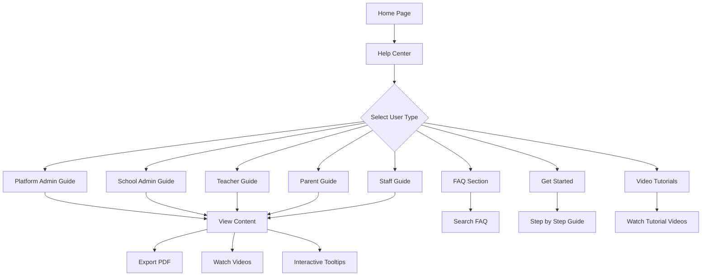

## 1. Product Overview
نظام مركز المساعدة المتكامل داخل منصة إدارة المدارس، يوفر دليلاً شاملاً لجميع المستخدمين مع واجهة سهلة الاستخدام وقابلة للتوسعة.

- يحل مشكلة عدم وجود مصدر موحد للمساعدة والدعم داخل المنصة
- يخدم جميع فئات المستخدمين: المديرين، المعلمين، أولياء الأمور، الموظفين
- يوفر محتوى تفاعلياً مع فيديوهات، أسئلة شائعة، وإرشادات خطوة بخطوة

## 2. Core Features

### 2.1 User Roles
| Role | Registration Method | Core Permissions |
|------|---------------------|------------------|
| مدير المنصة | حساب إداري مسبق | الوصول الكامل لجميع الأدلة والإدارة |
| مدير المدرسة | تعيين من مدير المنصة | الوصول لأدلة المدرسة والتقارير |
| المعلم | تعيين من المدرسة | الوصول لدليل المعلم والجداول |
| ولي الأمر | تسجيل عبر المنصة | الوصول لدليل أولياء الأمور ومتابعة الطالب |
| الموظف المالي | تعيين من المدرسة | الوصول للدليل المالي فقط |
| موظف شؤون الطلاب | تعيين من المدرسة | الوصول لدليل شؤون الطلاب |
| موظف الموارد البشرية | تعيين من المدرسة | الوصول لدليل الموارد البشرية |

### 2.2 Feature Module
مركز المساعدة يتكون من الصفحات الرئيسية التالية:

1. **الصفحة الرئيسية لمركز المساعدة**: شريط بحث، قائمة الأقسام، أحدث التحديثات
2. **صفحة عرض الدليل**: محتوى الدليل مع خيار تصدير PDF، فيديوهات تعليمية
3. **صفحة الأسئلة الشائعة**: تصنيفات الأسئلة، بحث داخلي
4. **صفحة كيفية البدء**: دليل خطوة بخطوة للمستخدمين الجدد
5. **صفحة الفيديوهات التعليمية**: مكتبة الفيديوهات مع تصنيفات
6. **صفحة البحث المتقدم**: نتائج البحث مع تصفية حسب نوع المستخدم

### 2.3 Page Details
| Page Name | Module Name | Feature description |
|-----------|-------------|---------------------|
| الصفحة الرئيسية لمركز المساعدة | شريط البحث الرئيسي | تمكين البحث الفوري في جميع الأدلة والمحتوى |
| الصفحة الرئيسية لمركز المساعدة | قائمة الأقسام | عرض منظمة لجميع أدلة المستخدمين مع عدد المقالات |
| الصفحة الرئيسية لمركز المساعدة | أحدث التحديثات | عرض أحدث المقالات والتحديثات في الأدلة |
| صفحة عرض الدليل | محتوى الدليل | عرض محتوى Markdown مع تنسيق احترافي |
| صفحة عرض الدليل | خيار تصدير PDF | تمكين تصدير الدليل الكامل أو الأقسام إلى PDF |
| صفحة عرض الدليل | فيديوهات تعليمية | تضمين مشغل فيديو مع قائمة تشغيل |
| صفحة عرض الدليل | Tooltips تفاعلية | تلميحات داخلية لشرح العناصر الرئيسية |
| صفحة الأسئلة الشائعة | تصنيفات الأسئلة | تنظيم الأسئلة حسب الفئة والمستخدم |
| صفحة الأسئلة الشائعة | بحث داخلي | البحث في الأسئلة والإجابات |
| صفحة كيفية البدء | دليل خطوة بخطوة | إرشادات مصورة للمستخدمين الجدد |
| صفحة الفيديوهات التعليمية | مكتبة الفيديوهات | تصفح وتصنيف الفيديوهات حسب الموضوع |
| صفحة الفيديوهات التعليمية | مشغل الفيديو | مشغل داخلي مع خيارات التحكم |
| صفحة البحث المتقدم | تصفية النتائج | تصفية حسب نوع المستخدم، التاريخ، الفئة |
| صفحة البحث المتقدم | معاينة النتائج | عرض مقتطفات من المحتوى مع تمييز الكلمات المفتاحية |

## 3. Core Process
### تدفق المستخدم العام:
1. يدخل المستخدم إلى مركز المساعدة من القائمة الرئيسية
2. يختار نوع دليله (مدير، معلم، ولي أمر...) أو يستخدم البحث
3. يتصفح المحتوى أو يشاهد الفيديوهات التعليمية
4. يمكنه تصدير المحتوى إلى PDF أو مشاركته
5. يعود للصفحة الرئيسية أو يستمر في البحث

## 4. User Interface Design
### 4.1 Design Style
- الألوان الرئيسية: أزرق داكن (#1e40af) مع خلفية بيضاء
- الألوان الثانوية: رمادي فاتح (#f3f4f6) مع لمسات خضراء للعناصر النشطة
- أزرار: تصميم مستدير مع ظلال خفيفة
- الخطوط: Arabic/English fonts - Arial/Tahoma للعربية، Inter للإنجليزية
- حجم الخط: 16px للنص الأساسي، 14px للتفاصيل، 20px للعناوين
- نمط التخطيط: تصميم قائمة جانبية مع محتوى رئيسي
- الأيقونات: أيقونات Material Design مع دعم الإيموجي

### 4.2 Page Design Overview
| Page Name | Module Name | UI Elements |
|-----------|-------------|-------------|
| الصفحة الرئيسية لمركز المساعدة | شريط البحث | تصميم prominent في الأعلى مع خلفية متدرجة، حقل إدخال كبير مع أيقونة بحث |
| الصفحة الرئيسية لمركز المساعدة | قائمة الأقسام | بطاقات (Cards) متجاوبة مع أيقونات وعدد المقالات، ترتيب شبكي responsive |
| صفحة عرض الدليل | محتوى الدليل | منطقة محتوى واسعة مع تنسيق Markdown، خط عربي واضح، مسافات مناسبة |
| صفحة عرض الدليل | شريط جانبي | قائمة متداخلة (Tree view) لأقسام الدليل مع مؤشر التقدم |
| صفحة عرض الدليل | أزرار الإجراءات | أزرار floating لexport PDF، print، share مع أيقونات واضحة |
| صفحة الفيديوهات التعليمية | شبكة الفيديوهات | معرض فيديوهات thumbnail مع عنوان ومدة الفيديو، تصفية حسب الفئة |
| صفحة الأسئلة الشائعة | قائمة الأسئلة | تصميم accordion يتمدد ليعرض الإجابة، أيقونة +/-/🔍 |

### 4.3 Responsiveness
- تصميم يبدأ من Desktop-first مع التكيف للأجهزة اللوحية والمحمولة
- دعم اللغة العربية (RTL) بالكامل مع تجاوب النصوص
- تحسين التفاعل باللمس للأجهزة المحمولة
- تكيف شريط البحث والقوائم مع شاشات صغيرة