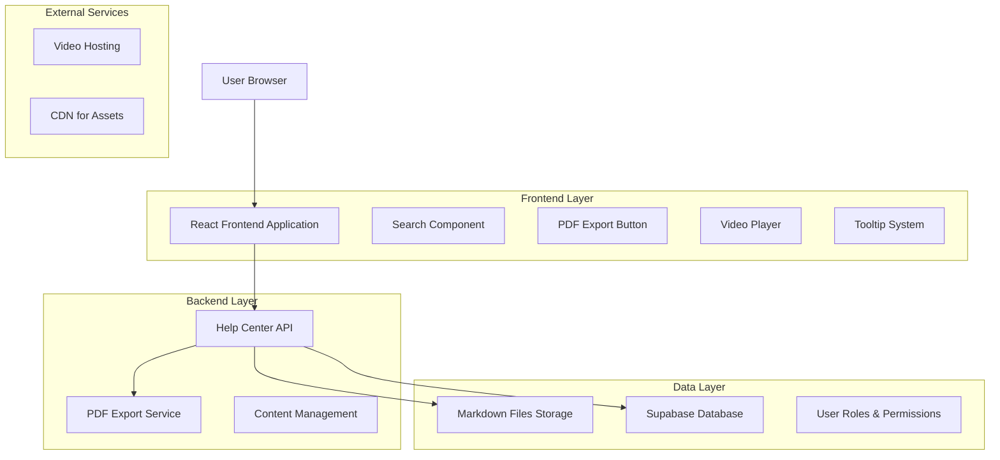
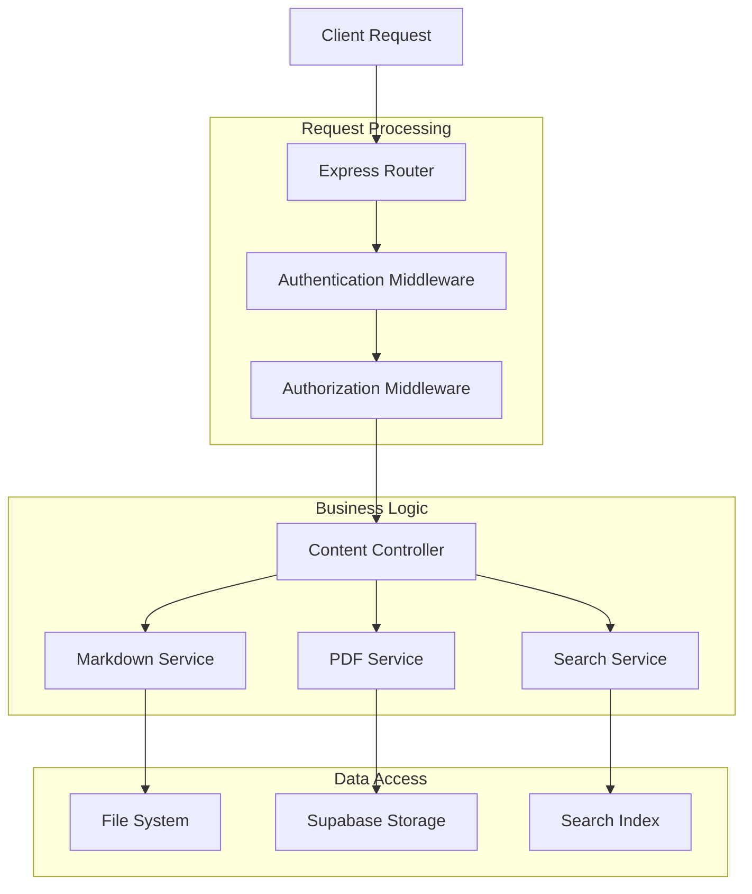
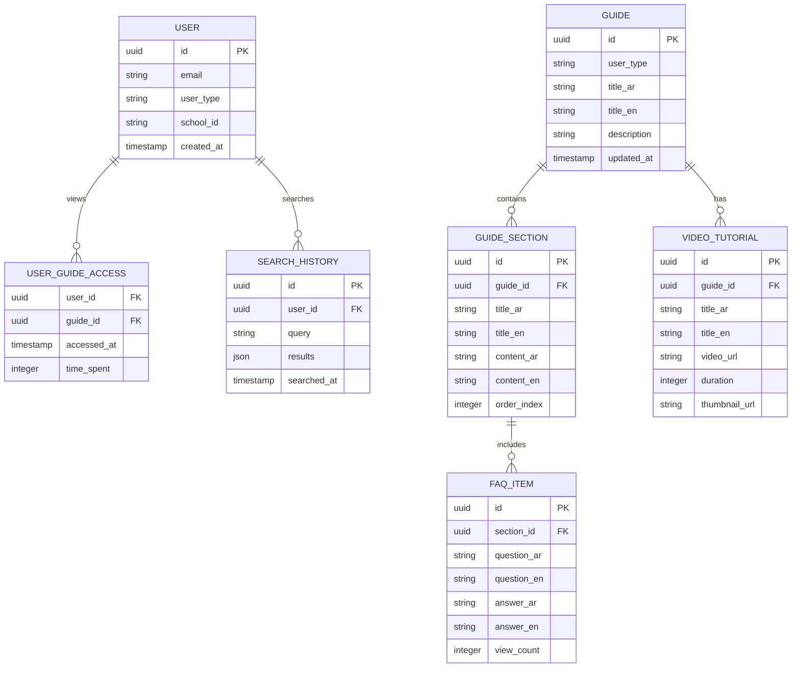

## 1. Architecture design



## 2. Technology Description
- Frontend: React@18 + tailwindcss@3 + vite
- Initialization Tool: vite-init
- Backend: Node.js@18 + Express@4
- Database: Supabase (PostgreSQL)
- File Storage: Supabase Storage (for PDF exports)
- Content Management: Markdown files with frontmatter
- Search Engine: Fuse.js (client-side search)
- PDF Export: Puppeteer or html2pdf.js
- Video Player: Video.js or React Player

## 3. Route definitions
| Route | Purpose |
|-------|---------|
| /help-center | Main help center page with search and sections |
| /help-center/guide/:userType | Specific guide page for each user type |
| /help-center/faq | FAQ section with categorized questions |
| /help-center/getting-started | Get started guide for new users |
| /help-center/videos | Video tutorials library |
| /help-center/search | Advanced search with filters |
| /help-center/admin | Admin panel for managing content |

## 4. API definitions
### 4.1 Content Management API

Get guide content
```
GET /api/help/guide/:userType
```

Request:
| Param Name| Param Type  | isRequired  | Description |
|-----------|-------------|-------------|-------------|
| userType  | string      | true        | Type of user (admin, teacher, parent, etc.) |
| section   | string      | false       | Specific section within the guide |

Response:
| Param Name| Param Type  | Description |
|-----------|-------------|-------------|
| content   | string      | Markdown content of the guide |
| sections  | array       | List of available sections |
| videos    | array       | Related video tutorials |
| updatedAt | timestamp   | Last update time |

Example
```json
{
  "content": "# دليل المعلم...",
  "sections": ["الحضور", "الجداول", "التقارير"],
  "videos": [{"title": "شرح النظام", "url": "video.mp4"}],
  "updatedAt": "2025-12-03T10:00:00Z"
}
```

### 4.2 Search API
```
GET /api/help/search
```

Request:
| Param Name| Param Type  | isRequired  | Description |
|-----------|-------------|-------------|-------------|
| query     | string      | true        | Search query |
| userType  | string      | false       | Filter by user type |
| category  | string      | false       | Filter by category |

### 4.3 PDF Export API
```
POST /api/help/export-pdf
```

Request:
| Param Name| Param Type  | isRequired  | Description |
|-----------|-------------|-------------|-------------|
| content   | string      | true        | HTML content to export |
| title     | string      | true        | PDF document title |
| userType  | string      | true        | User type for formatting |

## 5. Server architecture diagram


## 6. Data model

### 6.1 Data model definition


### 6.2 Data Definition Language
User Guide Access Table (user_guide_access)
```sql
-- create table
CREATE TABLE user_guide_access (
    user_id UUID REFERENCES users(id),
    guide_id UUID REFERENCES guides(id),
    accessed_at TIMESTAMP WITH TIME ZONE DEFAULT NOW(),
    time_spent INTEGER DEFAULT 0,
    PRIMARY KEY (user_id, guide_id)
);

-- create indexes
CREATE INDEX idx_user_guide_access_user_id ON user_guide_access(user_id);
CREATE INDEX idx_user_guide_access_guide_id ON user_guide_access(guide_id);
CREATE INDEX idx_user_guide_access_accessed_at ON user_guide_access(accessed_at DESC);

-- grant permissions
GRANT SELECT ON user_guide_access TO anon;
GRANT ALL PRIVILEGES ON user_guide_access TO authenticated;
```

Guides Table (guides)
```sql
-- create table
CREATE TABLE guides (
    id UUID PRIMARY KEY DEFAULT gen_random_uuid(),
    user_type VARCHAR(50) NOT NULL UNIQUE,
    title_ar VARCHAR(255) NOT NULL,
    title_en VARCHAR(255) NOT NULL,
    description_ar TEXT,
    description_en TEXT,
    is_active BOOLEAN DEFAULT true,
    created_at TIMESTAMP WITH TIME ZONE DEFAULT NOW(),
    updated_at TIMESTAMP WITH TIME ZONE DEFAULT NOW()
);

-- insert initial data
INSERT INTO guides (user_type, title_ar, title_en, title_ar, title_en) VALUES
('platform_admin', 'دليل مدير المنصة', 'Platform Admin Guide', 'دليل شامل لإدارة المنصة', 'Comprehensive platform management guide'),
('school_admin', 'دليل مدير المدرسة', 'School Admin Guide', 'دليل إدارة المدرسة والطلاب', 'School and student management guide'),
('teacher', 'دليل المعلم', 'Teacher Guide', 'دليل المعلم وإدارة الصفوف', 'Teacher and classroom management guide'),
('parent', 'دليل ولي الأمر', 'Parent Guide', 'دليل متابعة أبنائك الدراسية', 'Student progress tracking guide'),
('financial_staff', 'دليل الموظفين - المالية', 'Financial Staff Guide', 'دليل إدارة الشؤون المالية', 'Financial management guide');
```

FAQ Items Table (faq_items)
```sql
-- create table
CREATE TABLE faq_items (
    id UUID PRIMARY KEY DEFAULT gen_random_uuid(),
    section_id UUID REFERENCES guide_sections(id),
    question_ar VARCHAR(500) NOT NULL,
    question_en VARCHAR(500) NOT NULL,
    answer_ar TEXT NOT NULL,
    answer_en TEXT NOT NULL,
    view_count INTEGER DEFAULT 0,
    is_featured BOOLEAN DEFAULT false,
    created_at TIMESTAMP WITH TIME ZONE DEFAULT NOW(),
    updated_at TIMESTAMP WITH TIME ZONE DEFAULT NOW()
);

-- create indexes
CREATE INDEX idx_faq_items_section_id ON faq_items(section_id);
CREATE INDEX idx_faq_items_featured ON faq_items(is_featured);
CREATE INDEX idx_faq_items_view_count ON faq_items(view_count DESC);

-- grant permissions
GRANT SELECT ON faq_items TO anon;
GRANT ALL PRIVILEGES ON faq_items TO authenticated;
```

### 6.3 File Structure for Markdown Content
```
backend/docs/
├── platform-admin/
│   ├── getting-started.md
│   ├── user-management.md
│   ├── school-setup.md
│   └── reports.md
├── school-admin/
│   ├── dashboard.md
│   ├── student-management.md
│   ├── teacher-assignment.md
│   └── attendance.md
├── teacher/
│   ├── classroom-setup.md
│   ├── grade-management.md
│   ├── attendance-tracking.md
│   └── parent-communication.md
├── parent/
│   ├── account-setup.md
│   ├── student-tracking.md
│   ├── fee-payment.md
│   └── communication.md
├── staff/
│   ├── financial/
│   │   ├── fee-management.md
│   │   ├── payroll.md
│   │   └── reports.md
│   ├── student-affairs/
│   │   ├── registration.md
│   │   ├── transfers.md
│   │   └── documentation.md
│   └── hr/
│       ├── employee-records.md
│       ├── attendance.md
│       └── payroll.md
├── attendance/
├── schedules/
├── messages/
├── reports/
├── faq/
│   ├── general.md
│   ├── technical.md
│   ├── account.md
│   └── payment.md
└── videos/
    ├── tutorials.json
    └── transcripts/
```